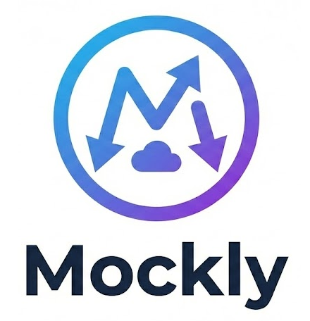

<h1 align="center">
  <br>
    
  <br>
</h1>


<h4 align="center">Fluent HTTP mocking for .NET like it should have done</h4>


<div align="center">

[](https://github.com/dennisdoomen/mockly/actions?query=branch%3amain)
[](https://coveralls.io/github/dennisdoomen/mockly?branch=main)
[](https://github.com/dennisdoomen/mockly/releases/latest)
[](https://www.nuget.org/packages/mockly)
[](https://libraries.io/nuget/mockly)

[](https://github.com/dennisdoomen/mockly/graphs/contributors)
[](https://github.com/dennisdoomen/mockly)
[](https://github.com/dennisdoomen/mockly/graphs/commit-activity)
[](https://github.com/dennisdoomen/mockly/issues)

[](https://makeapullrequest.com)


<a href="#about">About</a> •
<a href="#key-features">Key Features</a> •
<a href="#quick-start">Quick Start</a> •
<a href="#usage">Usage</a> •
<a href="#advanced-features">Advanced Features</a> •
<a href="#building">Building</a> •
<a href="#contributing">Contributing</a> •
<a href="#license">License</a>

</div>

## About

### What's this?

**Mockly** is a powerful and flexible HTTP mocking library for .NET that makes it easy to test code that depends on `HttpClient`. It provides a fluent API for configuring HTTP request mocks, capturing request details, and asserting on HTTP interactions in your tests.

The library supports:
* **.NET Framework 4.7.2** and higher
* **.NET 8.0** and higher
* **FluentAssertions 7.x and 8.x** integration for expressive test assertions

### What's so special about that?

Unlike other HTTP mocking libraries, Mockly offers:

* **Fluent, intuitive API** - Chain method calls to build complex mocking scenarios with ease
* **Wildcard pattern matching** - Match URLs using wildcards (`*`) in paths and query strings
* **Custom matchers** - Use predicates for advanced request matching logic
* **Request capture & inspection** - Automatically capture all requests with full metadata (headers, body, timestamp)
* **Powerful assertions** - Built-in FluentAssertions extensions for verifying HTTP behavior
* **Diagnostic support** - Detailed error messages when unexpected requests occur
* **Extensibility** - Design allows for custom response generators and matchers
* **Zero configuration** - Works out of the box with sensible defaults
* **Performance optimized** - Regex patterns are cached for efficient matching
* **Invocation limits** - Restrict how many times a mock can respond using `Once()`, `Twice()`, or `Times(n)`

### Who created this?

Mockly is created and maintained by [Dennis Doomen](https://github.com/dennisdoomen), also the creator of [FluentAssertions](https://fluentassertions.com/), [PackageGuard](https://github.com/dennisdoomen/packageguard), [Reflectify](https://github.com/dennisdoomen/reflectify), [Pathy](https://github.com/dennisdoomen/pathy) and the [.NET Library Starter Kit](https://github.com/dennisdoomen/dotnet-library-starter-kit). It's designed to work seamlessly with modern .NET testing practices and integrates naturally with FluentAssertions for expressive test assertions.

## Key Features

### 🎯 Fluent Request Matching

```csharp
mock.ForGet().WithPath("/api/users/*").RespondsWithJsonContent(user);
mock.ForPost().WithPath("/api/data").WithQuery("?filter=*").RespondsWithStatus(HttpStatusCode.Created);
```

### 📃 Clear Reporting

When an unexpected request occurs and there are configured mocks, Mockly helps you diagnose by reporting the closest matching mock (method, scheme/host/path/query) so you can quickly see what to adjust in your setup.

```
Unexpected request to:
  GET http://localhost/fnv_collectiveschemes(111)

Closest matching mock:
  GET https://*/fnv_collectiveschemes(123*)

Registered mocks:
 - GET https://*/fnv_collectiveschemes
 - POST https://*/fnv_collectiveschemes
 - GET https://*/fnv_collectiveschemes(123*)
 - GET https://*/fnv_collectiveschemes(123*) (1 custom matcher(s)) where (request => request.Uri?.Query == "?$count=1")
 - GET https://*/fnv_collectiveschemes(456)
```

### 🔍 Request Capture & Inspection

```csharp
var patches = new RequestCollection();
mock.ForPatch().WithPath("/api/update").CollectingRequestIn(patches);

// After test execution
patches.Count.Should().Be(3);
patches.First().Path.Should().Contain("/api/update");
```

### ✅ Powerful Assertions

```csharp
mock.Should().HaveAllRequestsCalled();
mock.Requests.Should().NotBeEmpty();
mock.Requests.Should().NotContainUnexpectedCalls();

// Assert JSON-equivalence using a JSON string (ignores formatting/ordering)
mock.Requests.Should().ContainRequest()
    .WithBodyMatchingJson("{ \"id\": 1, \"name\": \"x\" }");

// Assert the body deserializes and is equivalent to an object graph
var expected = new { id = 1, name = "x" };

mock.Requests.Should().ContainRequestForUrl("http://localhost:7021/api/*")
    .WithBodyEquivalentTo(expected);

// Assert the body has specific properties (deserialized as a dictionary)
var expectedProps = new Dictionary<string, string>
{
    ["id"] = "1",
    ["name"] = "x"
};

mock.Requests.Should().ContainRequest()
    .WithBodyHavingPropertiesOf(expectedProps);
```

### 🎨 Multiple Response Types

* JSON content with automatic serialization
* Raw string content
* Custom HTTP status codes
* Custom response generators
* OData support

### 🛡️ Fail-Fast Testing

```csharp
mock.FailOnUnexpectedCalls = true; // Default behavior
// Throws UnexpectedRequestException if an unmocked request is made
```

## Quick Start

Install the package:

```bash
dotnet add package mockly
```

To get the assertions, also install one of the two assertion packages, depending on which version of Fluent Assertions you're using:

```bash
dotnet add package FluentAssertions.Mockly.v7
dotnet add package FluentAssertions.Mockly.v8
```

Basic usage:

```csharp
using Mockly;
using FluentAssertions;

// Arrange
var mock = new HttpMock();
mock.ForGet()
    .WithPath("/api/users/123")
    .RespondsWithJsonContent(new { Id = 123, Name = "John Doe" });

HttpClient client = mock.GetClient();

// Act
var response = await client.GetAsync("http://localhost/api/users/123");
var content = await response.Content.ReadAsStringAsync();

// Assert
response.StatusCode.Should().Be(HttpStatusCode.OK);
content.Should().Contain("John Doe");
mock.Should().HaveAllRequestsCalled();
```

## Usage

### Basic Mocking

Create an `HttpMock` instance and configure it using the fluent API:

```csharp
var mock = new HttpMock();

// Mock a GET request
mock.ForGet()
    .WithPath("/api/products")
    .RespondsWithJsonContent(new[]
    {
        new { Id = 1, Name = "Product 1" },
        new { Id = 2, Name = "Product 2" }
    });

// Get the HttpClient
HttpClient client = mock.GetClient();
```

### Using IHttpClientFactory

If your code expects an `IHttpClientFactory`, Mockly can provide one that produces clients wired to the mock:

```csharp
var mock = new HttpMock();
mock.ForGet().WithPath("/ping").RespondsWithStatus(HttpStatusCode.OK);

var factory = mock.GetClientFactory();
HttpClient client = factory.CreateClient("any");

var response = await client.GetAsync("http://localhost/ping");
response.StatusCode.Should().Be(HttpStatusCode.OK);
```

### HTTP Method Support

```csharp
mock.ForGet()     // GET requests
mock.ForPost()    // POST requests
mock.ForPut()     // PUT requests
mock.ForPatch()   // PATCH requests
mock.ForDelete()  // DELETE requests
```

### Full-URL Shortcuts (with wildcards)

Instead of configuring scheme/host/path/query separately, you can provide a single full URL pattern to each `ForXxx` method. Wildcards (`*`) are supported in the host, path, and query parts.

```csharp
// GET: full https URL, wildcard path and query
mock.ForGet("https://api.example.com/users/*?q=*")
    .RespondsWithStatus(HttpStatusCode.OK);

// POST: wildcard host and path
mock.ForPost("http://*.example.com/*")
    .RespondsWithStatus(HttpStatusCode.Created);

// PUT: full https URL with wildcard path and query
mock.ForPut("https://api.example.com/items/*?filter=*")
    .RespondsWithStatus(HttpStatusCode.OK);

// PATCH: wildcard host and path
mock.ForPatch("http://*.contoso.local/*")
    .RespondsWithStatus(HttpStatusCode.OK);

// DELETE: specific host and path; since no query is specified, a request that has a query will NOT match
mock.ForDelete("http://localhost/api/items/*")
    .RespondsWithEmptyContent(HttpStatusCode.NoContent);
```

### Path and Query Matching

**Exact matching:**
```csharp
mock.ForGet().WithPath("/api/users/123");
```

**Wildcard matching:**
```csharp
// Match any user ID
mock.ForGet().WithPath("/api/users/*");

// Match query parameters with wildcards
mock.ForGet()
    .WithPath("/api/search")
    .WithQuery("?q=*&limit=10");
```

### Response Configuration

**JSON responses:**
```csharp
mock.ForGet()
    .WithPath("/api/user")
    .RespondsWithJsonContent(new { Id = 1, Name = "John" });
```

**String content:**
```csharp
mock.ForGet()
    .WithPath("/api/text")
    .RespondsWithContent("Hello, World!", "text/plain");
```

**Status codes:**
```csharp
mock.ForPost()
    .WithPath("/api/create")
    .RespondsWithStatus(HttpStatusCode.Created);
```

**Empty responses:**
```csharp
mock.ForDelete()
    .WithPath("/api/resource/123")
    .RespondsWithEmptyContent(HttpStatusCode.NoContent);
```

**Custom responses:**
```csharp
mock.ForGet()
    .WithPath("/api/custom")
    .RespondsWith(request =>
    {
        var response = new HttpResponseMessage(HttpStatusCode.OK);
        response.Headers.Add("X-Custom-Header", "value");
        response.Content = new StringContent("Custom content");
        return response;
    });
```

## Advanced Features

### Custom Matchers

Use predicates for advanced matching logic:

```csharp
mock.ForGet()
    .WithPath("/api/data")
    .With(request => request.Headers.Contains("X-API-Key"))
    .RespondsWithStatus(HttpStatusCode.OK);
```

Inspect the request body in your predicate:

```csharp
mock.ForPost()
    .WithPath("/api/test")
    .With(req => req.Body!.Contains("something"))
    .RespondsWithStatus(HttpStatusCode.NoContent);
```

Async predicate matching is supported:

```csharp
mock.ForGet()
    .WithPath("/api/async")
    .With(async req =>
    {
        await Task.Delay(1);
        return req.Uri!.Query == "?q=test";
    })
    .RespondsWithStatus(HttpStatusCode.OK);
```

If no mock matches, an `UnexpectedRequestException` is thrown when `FailOnUnexpectedCalls` is `true` (default).

### Body Matching

Match request bodies using different strategies:

```csharp
// Wildcard pattern
mock.ForPost()
    .WithPath("/api/test")
    .WithBody("*something*")
    .RespondsWithStatus(HttpStatusCode.NoContent);

// JSON equivalence (layout/whitespace independent)
mock.ForPost()
    .WithPath("/api/json")
    .WithBodyMatchingJson("{\"name\": \"John\", \"age\": 30}")
    .RespondsWithStatus(HttpStatusCode.NoContent);

// Regular expression
mock.ForPost()
    .WithPath("/api/test")
    .WithBodyMatchingRegex(".*something.*")
    .RespondsWithStatus(HttpStatusCode.NoContent);
```

Note: if the body cannot be parsed as JSON for `WithBodyMatchingJson`, a `RequestMatchingException` is thrown.

### Request Body Prefetching

By default, Mockly prefetches the request body for matchers. You can disable this to defer reading content inside your predicate:

```csharp
var mock = new HttpMock { PrefetchBody = false };

RequestInfo? captured = null;

mock.ForPost()
    .WithPath("/api/test")
    .With(req =>
    {
        captured = req; // req.Body can be read lazily here by your predicate
        return true;
    })
    .RespondsWithStatus(HttpStatusCode.OK);
```

What PrefetchBody does and when to use it:

- Purpose: When PrefetchBody is true (default), Mockly eagerly reads and caches the HTTP request body into RequestInfo.Body so that matchers and later assertions can inspect it without re-reading the stream.
- When to disable: Turn it off for scenarios with large or streaming content where reading the body up front is expensive or undesirable. In that case, RequestInfo.Body will be null unless your own predicate reads it.
- Impact on assertions: Body-based assertions (see Assertions section below) require the body to be available. Keep PrefetchBody enabled if you plan to assert on the request body after the call.

### Limiting mock invocations

Sometimes you want a mock to respond only a limited number of times. You can restrict a mock using the fluent methods `Once()`, `Twice()`, or `Times(int count)` on the request builder. After the configured number of invocations is reached, the mock is considered exhausted and will no longer match requests.

```csharp
var mock = new HttpMock();

// Single-use response
mock.ForGet()
    .WithPath("/api/item")
    .Once()
    .RespondsWithStatus(HttpStatusCode.OK);

// Exactly two times
mock.ForPost()
    .WithPath("/api/items")
    .Twice()
    .RespondsWithJsonContent(new { ok = true });

// Exactly N times
mock.ForDelete()
    .WithPath("/api/items/*")
    .Times(3)
    .RespondsWithEmptyContent();
```

Behavior notes:

- Exhausted mocks are skipped when matching. If no other non-exhausted mock matches and `FailOnUnexpectedCalls` is `true` (default), an `UnexpectedRequestException` is thrown.
- The mocks are evaluated in the order they were created.
- The default for mocks without limits is unlimited invocations
- The verification helpers consider limits:
  - `HttpMock.AllMocksInvoked` returns `true` only when each mock has been called at least once or has reached its configured `Times(..)` limit.
  - `HttpMock.GetUninvokedMocks()` lists mocks that haven’t reached their required count (or have 0 calls for unlimited mocks).

### Request Collection

Capture requests for specific mocks:

```csharp
var capturedRequests = new RequestCollection();

mock.ForPatch()
    .WithPath("/api/update")
    .CollectingRequestIn(capturedRequests)
    .RespondsWithStatus(HttpStatusCode.NoContent);

// After making requests
capturedRequests.Count.Should().Be(2);
capturedRequests.First().WasExpected.Should().BeTrue();
```

### Request Inspection

Access all captured requests globally:

```csharp
var allRequests = mock.Requests;

allRequests.Count.Should().Be(5);
allRequests.Should().NotContainUnexpectedCalls();

var firstRequest = allRequests.First();
firstRequest.Method.Should().Be(HttpMethod.Get);
firstRequest.Path.Should().StartWith("/api/");
firstRequest.Timestamp.Should().BeCloseTo(DateTime.UtcNow, TimeSpan.FromSeconds(1));
```

### Assertions

**Verify all mocks were called:**
```csharp
mock.Should().HaveAllRequestsCalled();
```

**Verify no unexpected requests:**
```csharp
mock.Requests.Should().NotContainUnexpectedCalls();
```

**Verify request expectations:**
```csharp
var request = mock.Requests.First();
request.Should().BeExpected();
request.WasExpected.Should().BeTrue();
```

**Assert an unexpected request was captured:**
```csharp
var first = mock.Requests.First();
first.Should().BeUnexpected();
```

**Collection assertions:**
```csharp
mock.Requests.Should().NotBeEmpty();
mock.Requests.Should().HaveCount(3);
capturedRequests.Should().BeEmpty();
```

**Body assertions on captured requests:**

Use these to assert on the JSON body of a previously captured request:

```csharp
// Assert JSON-equivalence using a JSON string (ignores formatting/ordering)
mock.Requests.Should().ContainRequest()
    .WithBodyMatchingJson("{ \"id\": 1, \"name\": \"x\" }");

// Assert the body deserializes and is equivalent to an object graph
var expected = new { id = 1, name = "x" };
mock.Requests.Should().ContainRequest()
    .WithBodyEquivalentTo(expected);

// Assert the body has specific properties (deserialized as a dictionary)
var expectedProps = new Dictionary<string, string>
{
    ["id"] = "1",
    ["name"] = "x"
};
mock.Requests.Should().ContainRequest()
    .WithBodyHavingPropertiesOf(expectedProps);
```

Notes:
- These assertions operate on captured requests (mock.Requests). They are part of the FluentAssertions extensions shipped with Mockly.
- If you disabled HttpMock.PrefetchBody, RequestInfo.Body will be null; enable it when you need to assert on the body.

### Handling Unexpected Requests

By default, unexpected requests throw an exception:

```csharp
var mock = new HttpMock();
mock.FailOnUnexpectedCalls = true; // Default

// This will throw UnexpectedRequestException
await client.GetAsync("http://localhost/unmocked-path");
```

To allow unexpected requests:

```csharp
mock.FailOnUnexpectedCalls = false;

// Returns 404 NotFound instead of throwing
var response = await client.GetAsync("http://localhost/unmocked-path");
response.StatusCode.Should().Be(HttpStatusCode.NotFound);
```

### Continuing Configuration and Builder Lifecycle

You can continue adding mocks to an existing `HttpMock`:

```csharp
var mock = new HttpMock();

// Initial configuration
mock.ForGet().WithPath("/api/users").RespondsWithStatus(HttpStatusCode.OK);

var client = mock.GetClient();
// ... make some requests ...

// Add more mocks later
mock.ForPost().WithPath("/api/users").RespondsWithStatus(HttpStatusCode.Created);

Continue building can reuse parts of the previous builder for convenience. You can opt out with `Reset()`:

```csharp
mock.ForGet()
    .ForHttps().ForHost("somehost")
    .WithPath("/api/test")
    .WithQuery("?q=test")
    .RespondsWithStatus(HttpStatusCode.OK);

// Reset prevents reusing the previous builder's scheme/host
mock.Reset();

mock.ForGet()
    .WithPath("/api/test")
    .WithQuery("?q=test")
    .RespondsWithStatus(HttpStatusCode.NotModified);
```

To remove all configured mocks entirely, use `Clear()`:

```csharp
mock.Clear();
```

### OData Result Helpers

Produce OData-style envelopes directly from the builder:

```csharp
var items = new[] { new { Id = 1, Name = "A" }, new { Id = 2, Name = "B" } };

mock.ForGet()
    .WithPath("/odata/items")
    .RespondsWithODataResult(items);

// Empty result
mock.ForGet()
    .WithPath("/odata/empty")
    .RespondsWithODataResult(Array.Empty<object>());

// Include @odata.context and custom status code
mock.ForGet()
    .WithPath("/odata/ctx")
    .RespondsWithODataResult(items, context: "http://localhost/$metadata#items", statusCode: HttpStatusCode.OK);
```

// Same client works with new mocks
await client.PostAsync("http://localhost/api/users", content);
```

### Clearing Mocks

Reset all configured mocks:

```csharp
mock.Clear();
```

## Complete Example

Here's a comprehensive example showing multiple features:

```csharp
using Mockly;
using FluentAssertions;

public class UserServiceTests
{
    [Fact]
    public async Task Should_Handle_User_Operations()
    {
        // Arrange
        var mock = new HttpMock();
        var capturedPatches = new RequestCollection();

        // Configure mocks
        mock.ForGet()
            .WithPath("/api/users/*")
            .RespondsWithJsonContent(new { Id = 123, Name = "John Doe" });

        mock.ForPost()
            .WithPath("/api/users")
            .RespondsWithStatus(HttpStatusCode.Created);

        mock.ForPatch()
            .WithPath("/api/users/*")
            .CollectingRequestIn(capturedPatches)
            .RespondsWithStatus(HttpStatusCode.NoContent);

        HttpClient client = mock.GetClient();
        var service = new UserService(client);

        // Act
        var user = await service.GetUserAsync(123);
        await service.CreateUserAsync(new { Name = "Jane" });
        await service.UpdateUserAsync(123, new { Name = "John Updated" });

        // Assert
        user.Name.Should().Be("John Doe");
        mock.Should().HaveAllRequestsCalled();
        mock.Requests.Should().HaveCount(3);
        mock.Requests.Should().NotContainUnexpectedCalls();

        capturedPatches.Count.Should().Be(1);
        capturedPatches.First().Should().BeExpected();
    }
}
```

## Building

To build this repository locally, you need the following:
* The [.NET SDKs](https://dotnet.microsoft.com/en-us/download/visual-studio-sdks) for .NET 4.7 and 8.0.
* Visual Studio, JetBrains Rider or Visual Studio Code with the C# DevKit

You can also build, run the unit tests and package the code using the following command-line:

```bash
build.ps1
```

Or, if you have the [Nuke tool installed](https://nuke.build/docs/getting-started/installation/):

```bash
nuke
```

Also try using `--help` to see all the available options or `--plan` to see what the scripts does.

## Contributing

Your contributions are always welcome! Please have a look at the [contribution guidelines](CONTRIBUTING.md) first.

Previous contributors include:

<a href="https://github.com/dennisdoomen/mockly/graphs/contributors">
  
</a>

(Made with [contrib.rocks](https://contrib.rocks))

## Versioning
This library uses [Semantic Versioning](https://semver.org/) to give meaning to the version numbers. For the versions available, see the [releases](https://github.com/dennisdoomen/mockly/releases) on this repository.

## Credits
This library wouldn't have been possible without the following tools, packages and companies:

* [FluentAssertions](https://fluentassertions.com/) - Fluent API for asserting the results of unit tests by [Dennis Doomen](https://github.com/dennisdoomen)
* [Nuke](https://nuke.build/) - Smart automation for DevOps teams and CI/CD pipelines by [Matthias Koch](https://github.com/matkoch)
* [xUnit](https://xunit.net/) - Community-focused unit testing tool for .NET by [Brad Wilson](https://github.com/bradwilson)
* [Coverlet](https://github.com/coverlet-coverage/coverlet) - Cross platform code coverage for .NET by [Toni Solarin-Sodara](https://github.com/tonerdo)
* [GitVersion](https://gitversion.net/) - From git log to SemVer in no time
* [ReportGenerator](https://reportgenerator.io/) - Converts coverage reports by [Daniel Palme](https://github.com/danielpalme)
* [StyleCopyAnalyzer](https://github.com/DotNetAnalyzers/StyleCopAnalyzers) - StyleCop rules for .NET
* [Roslynator](https://github.com/dotnet/roslynator) - A set of code analysis tools for C# by [Josef Pihrt](https://github.com/josefpihrt)
* [CSharpCodingGuidelines](https://github.com/bkoelman/CSharpGuidelinesAnalyzer) - Roslyn analyzers by [Bart Koelman](https://github.com/bkoelman) to go with the [C# Coding Guidelines](https://csharpcodingguidelines.com/)
* [Meziantou](https://github.com/meziantou/Meziantou.Framework) - Another set of awesome Roslyn analyzers by [Gérald Barré](https://github.com/meziantou)

## Related Projects

You may also be interested in:

* [FluentAssertions](https://fluentassertions.com/) - The assertion library that Mockly integrates with
* [PackageGuard](https://github.com/dennisdoomen/packageguard) - Get a grip on your open-source packages
* [Reflectify](https://github.com/dennisdoomen/reflectify) - Reflection extensions without causing dependency pains
* [Pathy](https://github.com/dennisdoomen/pathy) - Fluently building and using file and directory paths without binary dependencies
* [.NET Library Starter Kit](https://github.com/dennisdoomen/dotnet-library-starter-kit) - A battle-tested starter kit for building open-source and internal NuGet libraries

## License
This project is licensed under the MIT License - see the [LICENSE](LICENSE) file for details.

