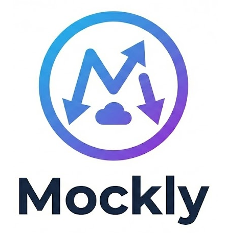

<h1 align="center">
  <br>
    
  <br>
</h1>


<h4 align="center">Fluent HTTP mocking for .NET like it should have been done</h4>


<div align="center">

[](https://github.com/dennisdoomen/mockly/actions?query=branch%3amain)
[](https://coveralls.io/github/dennisdoomen/mockly?branch=main)
[](https://github.com/dennisdoomen/mockly/releases/latest)
[](https://www.nuget.org/packages/mockly)
[](https://libraries.io/nuget/mockly)

[](https://github.com/dennisdoomen/mockly/graphs/contributors)
[](https://github.com/dennisdoomen/mockly)
[](https://github.com/dennisdoomen/mockly/graphs/commit-activity)
[](https://github.com/dennisdoomen/mockly/issues)

[](https://makeapullrequest.com)


</div>

## 📚 [Documentation](https://mockly.org/)

**Visit the [official documentation website](https://mockly.org/)** for comprehensive guides, API reference, and examples.

- [Quick Start](https://mockly.org/docs/quick-start) - Get started in 5 minutes
- [Usage Guide](https://mockly.org/docs/usage) - Learn core features
- [Advanced Features](https://mockly.org/docs/advanced) - Custom matchers, assertions, and more
- [Building](https://mockly.org/docs/building) - Build from source
- [Contributing](https://mockly.org/docs/contributing) - Contribution guidelines

## About

### What's this?

**Mockly** is a powerful and flexible HTTP mocking library for .NET that makes it easy to test code that depends on `HttpClient`. It provides a fluent API for configuring HTTP request mocks, capturing request details, and asserting on HTTP interactions in your tests.

The library supports:
* **.NET Framework 4.7.2** and higher
* **.NET 8.0** and higher
* **FluentAssertions 7.x and 8.x** integration for expressive test assertions

### What's so special about that?

Unlike other HTTP mocking libraries, Mockly offers:

* **Fluent, intuitive API** - Chain method calls to build complex mocking scenarios with ease
* **Wildcard pattern matching** - Match URLs using wildcards (`*`) in paths and query strings
* **First-class header matching** - Match request headers, bearer tokens, and content types directly
* **Custom matchers** - Use predicates for advanced request matching logic
* **Request capture & inspection** - Automatically capture all requests with full metadata (headers, body, timestamp)
* **Powerful assertions** - Built-in FluentAssertions extensions for verifying HTTP behavior
* **Diagnostic support** - Detailed error messages when unexpected requests occur
* **Extensibility** - Design allows for custom response generators and matchers
* **Zero configuration** - Works out of the box with sensible defaults
* **Performance optimized** - Regex patterns are cached for efficient matching
* **Invocation limits** - Restrict how many times a mock can respond using `Once()`, `Twice()`, or `Times(n)`

### Who created this?

Mockly is created and maintained by [Dennis Doomen](https://github.com/dennisdoomen), also the creator of [FluentAssertions](https://fluentassertions.com/), [PackageGuard](https://github.com/dennisdoomen/packageguard), [Reflectify](https://github.com/dennisdoomen/reflectify), [Pathy](https://github.com/dennisdoomen/pathy) and the [.NET Library Starter Kit](https://github.com/dennisdoomen/dotnet-library-starter-kit). It's designed to work seamlessly with modern .NET testing practices and integrates naturally with FluentAssertions for expressive test assertions.

## Power in Simplicity

```csharp
using var mock = new HttpMock();

// 1. Match with full URL shortcuts and wildcards
// 2. Filter by specific query parameters
// 3. Use custom JSON options for serialization
var options = new JsonSerializerOptions { PropertyNamingPolicy = JsonNamingPolicy.CamelCase };

mock.ForGet("https://api.github.com/repos/*/issues?state=open")
    .WithQueryParam("page", "1")
    .Using(options)
    .RespondsWithJsonContent(new[] { 
        new { Id = 1, Title = "Found a bug" },
        new { Id = 2, Title = "Feature request" }
    });

// 4. Match Bearer tokens and other headers
// 5. Match request body using JSON equivalence
// 6. Capture requests for later verification
var creations = new RequestCollection();

mock.ForPost()
    .WithPath("/api/users")
    .WithBearerToken("secret-token")
    .WithBody(new { Name = "John", Role = "Admin" })
    .CollectingRequestsIn(creations)
    .RespondsWithStatus(HttpStatusCode.Created);

// 7. Built-in support for Problem Details (RFC 7807)
mock.ForGet("/api/users/999")
    .RespondsWithProblemDetails(HttpStatusCode.NotFound, "User not found");

// Get the pre-configured HttpClient and start testing!
var client = mock.GetClient();

// 8. Assert your expectations with FluentAssertions
mock.Should().HaveAllRequestsCalled();
creations.Should().ContainRequestFor("/api/users")
    .Which.HasHeader("X-Trace-Id");
```

## Key Features

### 🎯 Fluent Request Matching

```csharp
mock.ForGet().WithPath("/api/users/*").RespondsWithJsonContent(user);
mock.ForPost().WithPath("/api/data").WithQuery("?filter=*").RespondsWithStatus(HttpStatusCode.Created);
mock.ForGet().WithPath("/api/secure").WithHeader("X-Api-Key").RespondsWithStatus(HttpStatusCode.OK);
mock.ForPost().WithPath("/api/auth").WithBearerToken("eyJ*").RespondsWithStatus(HttpStatusCode.OK);
mock.ForPost().WithPath("/api/json").WithContentType("application/json").RespondsWithStatus(HttpStatusCode.OK);
```

### 🏷️ Response Headers

Configure response headers such as `Location`, `ETag` or a custom `Content-Type`. Content headers are routed to the
response content automatically; all other headers are added to the response headers.

```csharp
mock.ForPost().WithPath("/api/users")
    .RespondsWithStatus(HttpStatusCode.Created)
    .WithHeader("Location", "/api/users/123")
    .WithHeader("ETag", "\"v1\"");
```

### 📃 Clear Reporting

When an unexpected request occurs and there are configured mocks, Mockly helps you diagnose by reporting the closest matching mock (method, scheme/host/path/query) so you can quickly see what to adjust in your setup.

```
Unexpected request to:
  GET http://localhost/fnv_collectiveschemes(111)

Closest matching mock:
  GET https://*/fnv_collectiveschemes(123*)

Registered mocks:
 - GET https://*/fnv_collectiveschemes
 - POST https://*/fnv_collectiveschemes
 - GET https://*/fnv_collectiveschemes(123*)
 - GET https://*/fnv_collectiveschemes(123*) (1 custom matcher(s)) where (request => request.Uri?.Query == "?$count=1")
 - GET https://*/fnv_collectiveschemes(456)
```

### 🔍 Request Capture & Inspection

```csharp
var patches = new RequestCollection();
mock.ForPatch().WithPath("/api/update").CollectingRequestsIn(patches);

// After test execution
patches.Count.Should().Be(3);
patches.First().Path.Should().Contain("/api/update");
```

### ✅ Powerful Assertions

```csharp
mock.Should().HaveAllRequestsCalled();
mock.Requests.Should().NotBeEmpty();
mock.Requests.Should().NotContainUnexpectedCalls();

// Assert JSON-equivalence using a JSON string (ignores formatting/ordering)
mock.Requests.Should().ContainRequest()
    .WithBodyMatchingJson("{ \"id\": 1, \"name\": \"John\" }");

// Assert the body deserializes and is equivalent to an object graph
var expected = new { id = 1, name = "John" };

mock.Requests.Should().ContainRequestFor("https://api.example.com/*")
    .WithBodyEquivalentTo(expected);
```

### 🎨 Multiple Response Types

* JSON content with automatic serialization
* Test data builder integration via `IResponseBuilder<T>`
* Raw string content
* Custom HTTP status codes
* Custom response generators
* OData support

### 🔁 Sequenced Responses

Configure a sequence of responses for the same matched request so consecutive calls get different responses (e.g. the classic "fail twice, then succeed" retry test). Chain `Then(...)` after any `RespondsWith*` method. The last response repeats for any calls beyond the configured sequence.

```csharp
mock.ForGet().WithPath("/resource")
    .RespondsWithStatus(HttpStatusCode.ServiceUnavailable)
    .Then(HttpStatusCode.ServiceUnavailable)
    .Then(HttpStatusCode.OK);
```

The `Then*` family mirrors the `RespondsWith*` methods (`ThenRespondsWithJsonContent`, `ThenRespondsWithContent`, `ThenRespondsWithODataResult`, and `Then(Func<RequestInfo, HttpResponseMessage>)`).

### 🛡️ Fail-Fast Testing

```csharp
mock.FailOnUnexpectedCalls = true; // Default behavior
// Throws UnexpectedRequestException if an unmocked request is made
```

## Quick Start

Install the package:

```bash
dotnet add package mockly
```

To get the assertions, also install one of the two assertion packages, depending on which version of FluentAssertions you're using:

```bash
dotnet add package FluentAssertions.Mockly.v7
dotnet add package FluentAssertions.Mockly.v8
```

Basic usage:

```csharp
using Mockly;
using FluentAssertions;

// Arrange
var mock = new HttpMock();
mock.ForGet()
    .WithPath("/api/users/123")
    .RespondsWithJsonContent(new { Id = 123, Name = "John Doe" });

HttpClient client = mock.GetClient();

// Act
// Note: BaseAddress defaults to https://localhost/
var response = await client.GetAsync("/api/users/123");
var content = await response.Content.ReadAsStringAsync();

// Assert
response.StatusCode.Should().Be(HttpStatusCode.OK);
content.Should().Contain("John Doe");
mock.Should().HaveAllRequestsCalled();
```

**For complete documentation and advanced examples, visit [mockly.org](https://mockly.org/)**

> [!TIP]
> This project ships an [Agent Skill](https://agentskills.io) that helps AI Coding Agents use Mockly effectively. [This file](./SKILL.md) will be stored in the `.agents/skills/mockly` directory of your project when you build the project. You can disable this behavior by setting `<MocklySkill>false</MocklySkill>` in your project or `Directory.Build.props`.

## Building

To build this repository locally, you need:
* The [.NET SDKs](https://dotnet.microsoft.com/en-us/download/visual-studio-sdks) for .NET 4.7 and 8.0.
* Visual Studio, JetBrains Rider or Visual Studio Code with the C# DevKit

Build using PowerShell:

```bash
./build.ps1
```

Or with the [Nuke tool](https://nuke.build/docs/getting-started/installation/):

```bash
nuke
```

For more details, see the [Building documentation](https://mockly.org/docs/building).

## Contributing

Your contributions are always welcome! Please have a look at the [contribution guidelines](CONTRIBUTING.md) first.

For detailed contribution information, visit the [Contributing documentation](https://mockly.org/docs/contributing).

Previous contributors:

<a href="https://github.com/dennisdoomen/mockly/graphs/contributors">
  
</a>

(Made with [contrib.rocks](https://contrib.rocks))

## Versioning

This library uses [Semantic Versioning](https://semver.org/) to give meaning to the version numbers. For the versions available, see the [releases](https://github.com/dennisdoomen/mockly/releases) on this repository.

## Credits

This library wouldn't have been possible without the following tools, packages and companies:

* [FluentAssertions](https://fluentassertions.com/) - Fluent API for asserting the results of unit tests by [Dennis Doomen](https://github.com/dennisdoomen)
* [Nuke](https://nuke.build/) - Smart automation for DevOps teams and CI/CD pipelines by [Matthias Koch](https://github.com/matkoch)
* [xUnit](https://xunit.net/) - Community-focused unit testing tool for .NET by [Brad Wilson](https://github.com/bradwilson)
* [Coverlet](https://github.com/coverlet-coverage/coverlet) - Cross platform code coverage for .NET by [Toni Solarin-Sodara](https://github.com/tonerdo)
* [GitVersion](https://gitversion.net/) - From git log to SemVer in no time
* [ReportGenerator](https://reportgenerator.io/) - Converts coverage reports by [Daniel Palme](https://github.com/danielpalme)
* [StyleCopyAnalyzer](https://github.com/DotNetAnalyzers/StyleCopAnalyzers) - StyleCop rules for .NET
* [Roslynator](https://github.com/dotnet/roslynator) - A set of code analysis tools for C# by [Josef Pihrt](https://github.com/josefpihrt)
* [CSharpCodingGuidelines](https://github.com/bkoelman/CSharpGuidelinesAnalyzer) - Roslyn analyzers by [Bart Koelman](https://github.com/bkoelman) to go with the [C# Coding Guidelines](https://csharpcodingguidelines.com/)
* [Meziantou](https://github.com/meziantou/Meziantou.Framework) - Another set of awesome Roslyn analyzers by [Gérald Barré](https://github.com/meziantou)

## Related Projects

You may also be interested in:

* [FluentAssertions](https://fluentassertions.com/) - The assertion library that Mockly integrates with
* [PackageGuard](https://github.com/dennisdoomen/packageguard) - Get a grip on your open-source packages
* [Reflectify](https://github.com/dennisdoomen/reflectify) - Reflection extensions without causing dependency pains
* [Pathy](https://github.com/dennisdoomen/pathy) - Fluently building and using file and directory paths without binary dependencies
* [.NET Library Starter Kit](https://github.com/dennisdoomen/dotnet-library-starter-kit) - A battle-tested starter kit for building open-source and internal NuGet libraries

## License

This project is licensed under the MIT License - see the [LICENSE](LICENSE) file for details.
